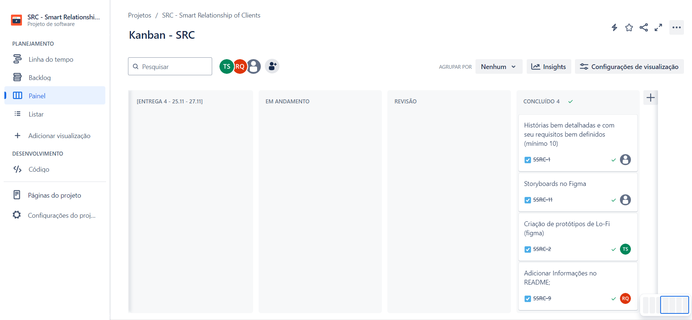
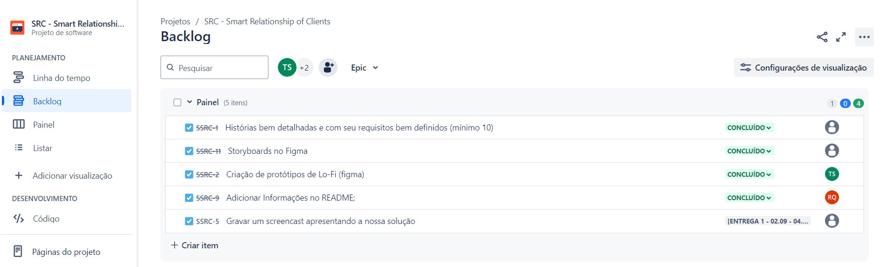
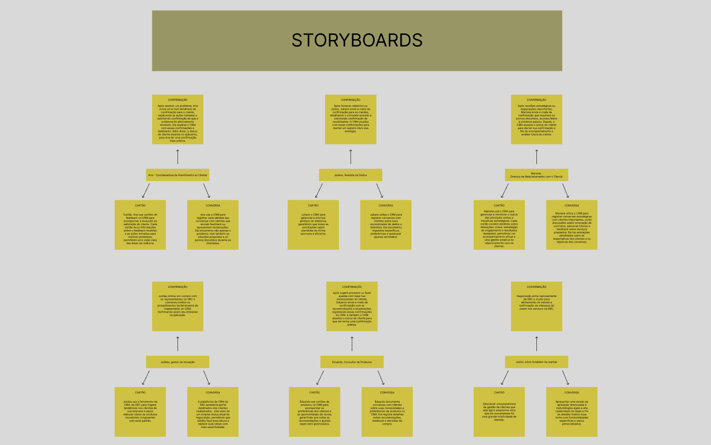

<div align="center">
    <h1>
        <b font-size: 20px;>🚀 SRC - Smart Relationship of Clients 🌟</b>
        </br>
        </br>
        
    </h1>
</div>

> [!NOTE]
> Projeto em inicio de desenvolvimento, sujeito a mudanças.

---

</br>
<p align="center">
    A SRC é uma solução poderosa e intuitiva, desenvolvida para transformar a maneira como sua empresa se relaciona com os clientes. Com uma interface amigável e funcionalidades avançadas, o SRC permite gerenciar todas as interações com seus clientes em um único lugar, promovendo um relacionamento mais próximo e personalizado. ⚡
</p>

## DRIVE
[Link do drive](https://drive.google.com/drive/u/4/folders/0AFF36nv8gFqdUk9PVA)
#### Entrega 1
[Link da entrega 1](https://drive.google.com/drive/u/4/folders/1EmybUog0gSd-5IMwIwxl0Fgz8bT8nZWN)


## JIRA
### Kanban


### Backlog


## Storyboard


[Link storyboard](https://www.figma.com/design/al5hOfTsa6lACnnjdWik5v/Untitled?node-id=0-1&node-type=CANVAS&t=drVKI27B0PURqVSL-0)

## Protótipo(sketch)


[Link protótipo](https://www.figma.com/design/uWUO2t1XNSkiNllAtFBE8P/Untitled?node-id=0-1&node-type=CANVAS&t=PeLcBHo24RN81PXQ-0)

## Screencast
[Link screencast](https://drive.google.com/drive/u/4/folders/1EmybUog0gSd-5IMwIwxl0Fgz8bT8nZWN)

## 💪 Nossa Equipe

*👨‍💼 Terry Damasio Santos - Project Manager

*👨‍💻 Rafael Varela Queimado

*👨‍💻 Heitor Santana Freitas Monteiro

*👨‍💻 Kerry Muniz Santos

*👩‍💻 ⁠Maria Júlia de Paula Martins Germano

*👨‍💻 Ricardo Block Veras Franco Neves

## ⚙️ Configuração rapida do projeto

### 💻 Criando virtual environment

>Criar venv

```powershell
python.exe -m venv env 
```

>Ativar venv

```powershell
./env/Scripts/activate.exe
```

>Instalar Dependencias do projeto (libs)

```powershell
pip.exe install -r requirements. txt
```

>Caso esteja sendo configurado em um computador do Cesar :shipit: executar o seguinte Script

```powershell
Set-ExecutionPolicy RemoteSigned -Scope CurrentUser
```

>O seguinte script atualiza a lista de dependencias (libs)

```powershell
python.exe -m pip freeze > requirements.txt
```

### 🏃 Rodando o Servidor Dev Local

>Navegue para a pasta Raiz do projeto

```bat
cd SRC
```

>Rode o servidor

```powershell
python.exe manage.py runserver
```
